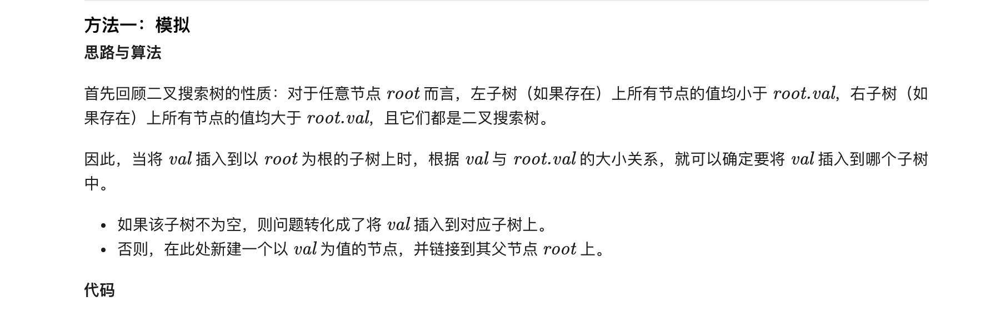
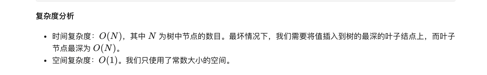

### 官方题解 [@link](https://leetcode-cn.com/problems/insert-into-a-binary-search-tree/solution/er-cha-sou-suo-shu-zhong-de-cha-ru-cao-zuo-by-le-3/)


```Golang
func insertIntoBST(root *TreeNode, val int) *TreeNode {
    if root == nil {
        return &TreeNode{Val: val}
    }
    p := root
    for p != nil {
        if val < p.Val {
            if p.Left == nil {
                p.Left = &TreeNode{Val: val}
                break
            }
            p = p.Left
        } else {
            if p.Right == nil {
                p.Right = &TreeNode{Val: val}
                break
            }
            p = p.Right
        }
    }
    return root
}
```
