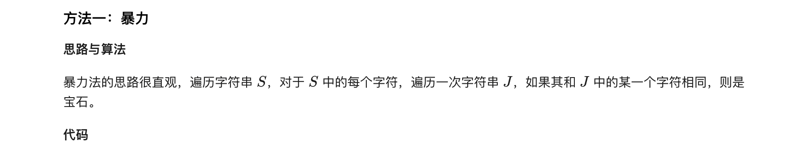
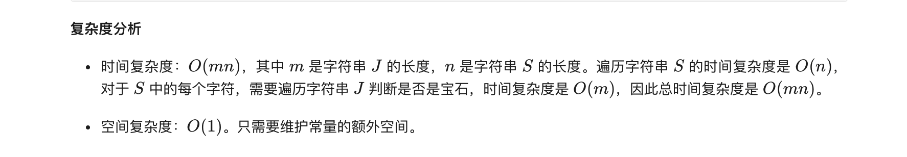
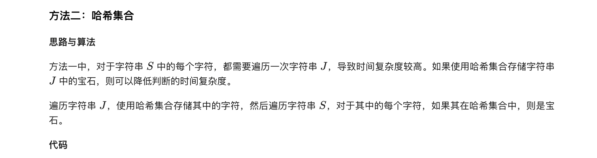
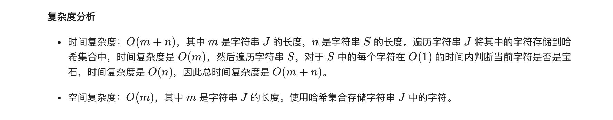

### 官方题解 [@link](https://leetcode-cn.com/problems/jewels-and-stones/solution/bao-shi-yu-shi-tou-by-leetcode-solution/)


```Golang
func numJewelsInStones(J string, S string) (sum int) {
    for _, s := range S {
        for _, j := range J {
            if s == j {
                sum++
                break
            }
        }
    }
    return
}
```


```Golang
func numJewelsInStones(J string, S string) (sum int) {
    jewelsSet := map[byte]bool{}
    for i := range J {
        jewelsSet[J[i]] = true
    }
    for i := range S {
        if jewelsSet[S[i]] {
            sum++
        }
    }
    return
}
```
