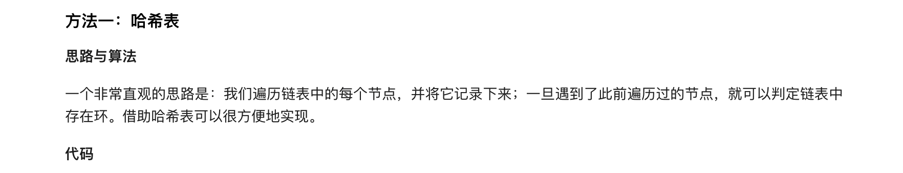
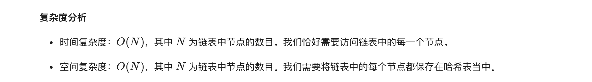
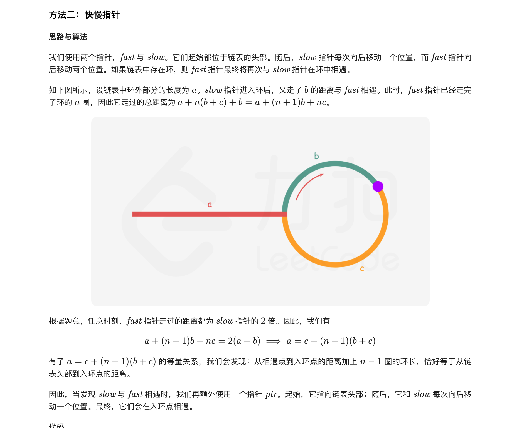
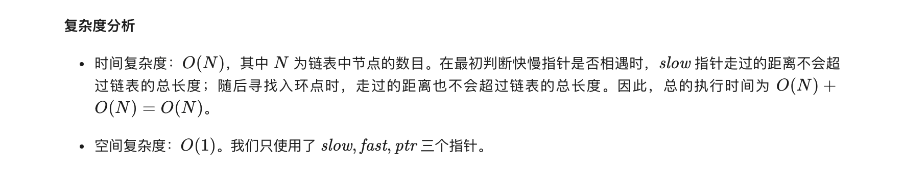

### 官方题解 [@link](https://leetcode-cn.com/problems/linked-list-cycle-ii/solution/huan-xing-lian-biao-ii-by-leetcode-solution/)


```Golang
func detectCycle(head *ListNode) *ListNode {
    seen := map[*ListNode]struct{}{}
    for head != nil {
        if _, ok := seen[head]; ok {
            return head
        }
        seen[head] = struct{}{}
        head = head.Next
    }
    return nil
}
```


```Golang
func detectCycle(head *ListNode) *ListNode {
    slow, fast := head, head
    for fast != nil {
        slow = slow.Next
        if fast.Next == nil {
            return nil
        }
        fast = fast.Next.Next
        if fast == slow {
            p := head
            for p != slow {
                p = p.Next
                slow = slow.Next
            }
            return p
        }
    }
    return nil
}
```
