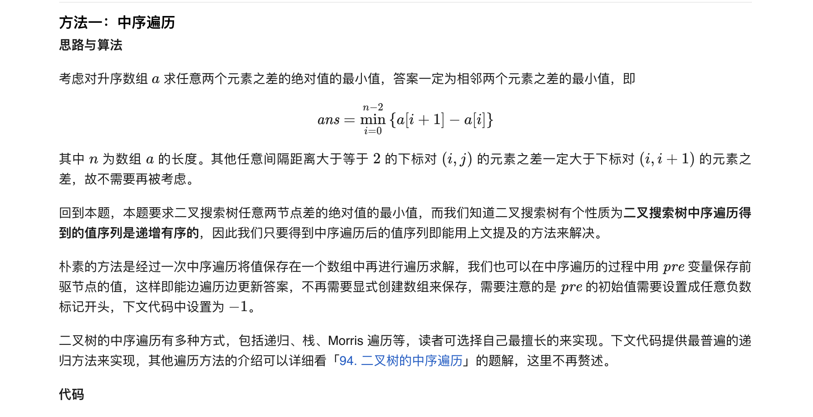
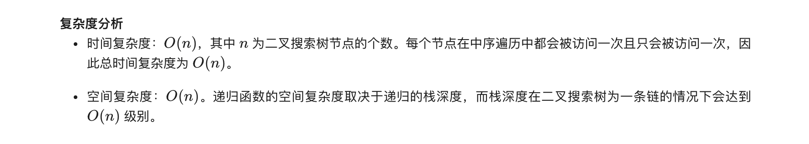

### 官方题解 [@link](https://leetcode-cn.com/problems/minimum-absolute-difference-in-bst/solution/er-cha-sou-suo-shu-de-zui-xiao-jue-dui-chai-by-lee/)


```Golang
func getMinimumDifference(root *TreeNode) int {
    ans, pre := math.MaxInt64, -1
    var dfs func(*TreeNode)
    dfs = func(node *TreeNode) {
        if node == nil {
            return
        }
        dfs(node.Left)
        if pre != -1 && node.Val-pre < ans {
            ans = node.Val - pre
        }
        pre = node.Val
        dfs(node.Right)
    }
    dfs(root)
    return ans
}
```
