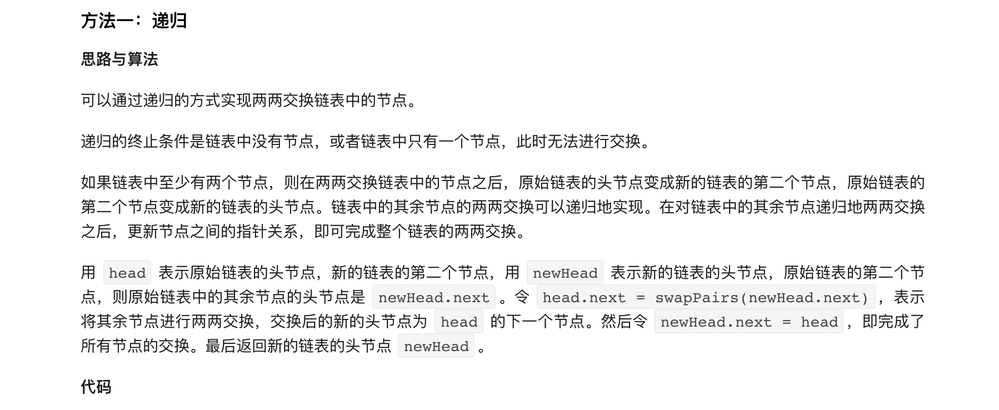
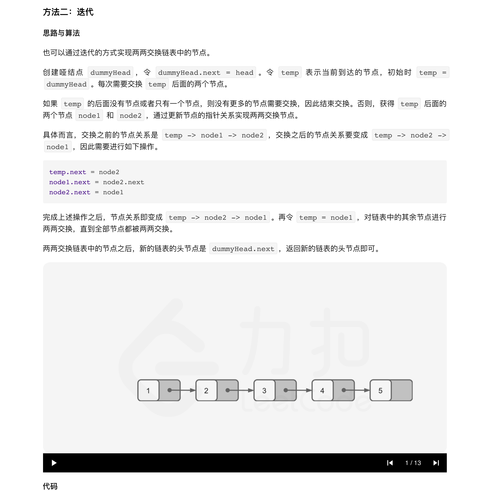

### 官方题解 [@link](https://leetcode-cn.com/problems/swap-nodes-in-pairs/solution/liang-liang-jiao-huan-lian-biao-zhong-de-jie-di-91/)


```Golang
func swapPairs(head *ListNode) *ListNode {
    if head == nil || head.Next == nil {
        return head
    }
    newHead := head.Next
    head.Next = swapPairs(newHead.Next)
    newHead.Next = head
    return newHead
}
```


```Golang
func swapPairs(head *ListNode) *ListNode {
    dummyHead := &ListNode{0, head}
    temp := dummyHead
    for temp.Next != nil && temp.Next.Next != nil {
        node1 := temp.Next
        node2 := temp.Next.Next
        temp.Next = node2
        node1.Next = node2.Next
        node2.Next = node1
        temp = node1
    }
    return dummyHead.Next
}
```
