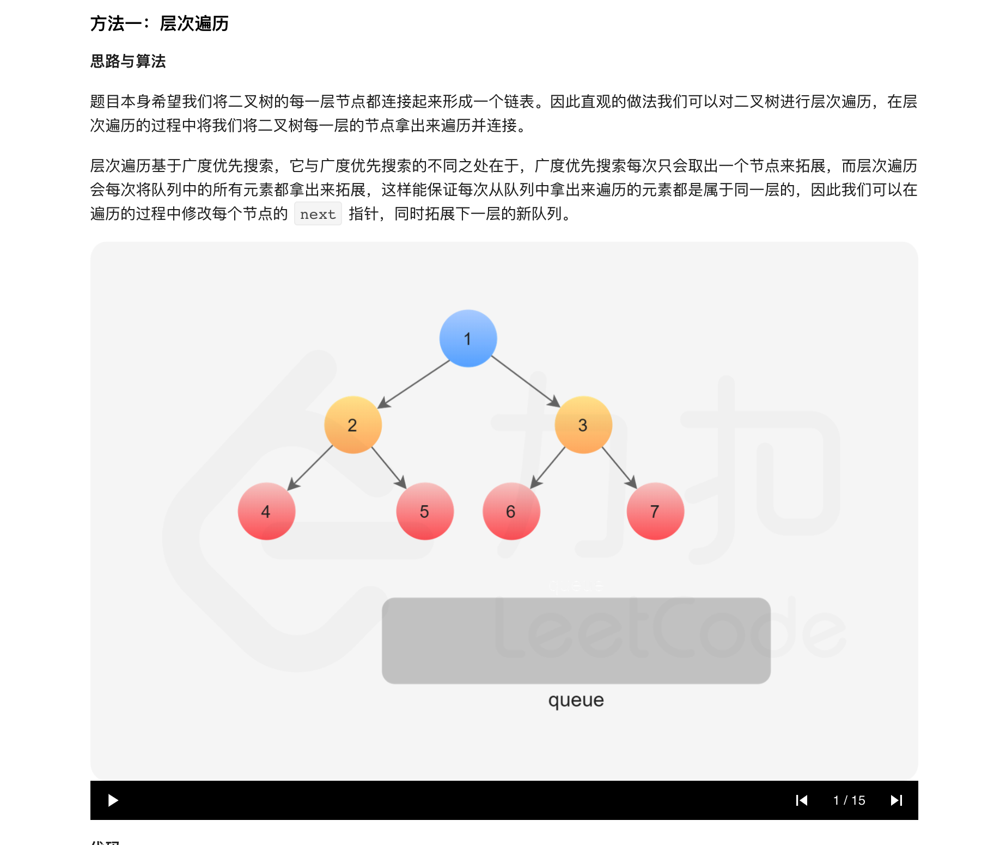
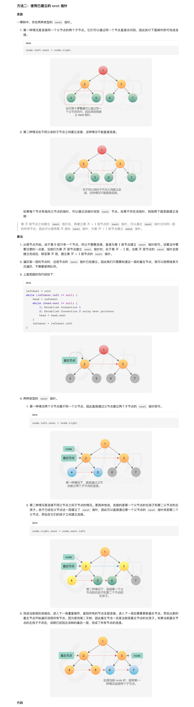

### 官方题解 [@link](https://leetcode-cn.com/problems/populating-next-right-pointers-in-each-node/solution/tian-chong-mei-ge-jie-dian-de-xia-yi-ge-you-ce-2-4/)


```Golang
func connect(root *Node) *Node {
    if root == nil {
        return root
    }

    // 初始化队列同时将第一层节点加入队列中，即根节点
    queue := []*Node{root}

    // 循环迭代的是层数
    for len(queue) > 0 {
        tmp := queue
        queue = nil

        // 遍历这一层的所有节点
        for i, node := range tmp {
            // 连接
            if i+1 < len(tmp) {
                node.Next = tmp[i+1]
            }

            // 拓展下一层节点
            if node.Left != nil {
                queue = append(queue, node.Left)
            }
            if node.Right != nil {
                queue = append(queue, node.Right)
            }
        }
    }

    // 返回根节点
    return root
}
```


```Golang
func connect(root *Node) *Node {
    if root == nil {
        return root
    }

    // 每次循环从该层的最左侧节点开始
    for leftmost := root; leftmost.Left != nil; leftmost = leftmost.Left {
        // 通过 Next 遍历这一层节点，为下一层的节点更新 Next 指针
        for node := leftmost; node != nil; node = node.Next {
            // 左节点指向右节点
            node.Left.Next = node.Right

            // 右节点指向下一个左节点
            if node.Next != nil {
                node.Right.Next = node.Next.Left
            }
        }
    }

    // 返回根节点
    return root
}
```
