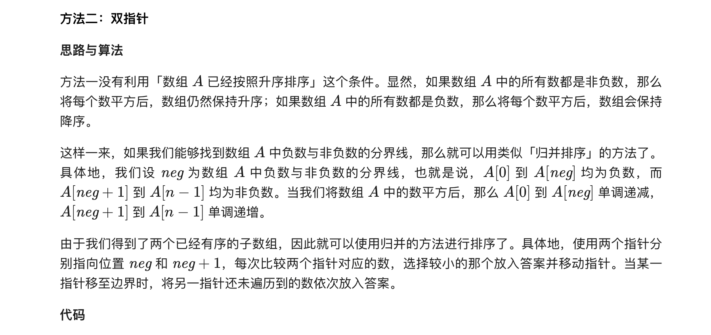

### 官方题解 [@link](https://leetcode-cn.com/problems/squares-of-a-sorted-array/solution/you-xu-shu-zu-de-ping-fang-by-leetcode-solution/)


```Golang
func sortedSquares(a []int) []int {
    ans := make([]int, len(a))
    for i, v := range a {
        ans[i] = v * v
    }
    sort.Ints(ans)
    return ans
}
```


```Golang
func sortedSquares(a []int) []int {
    n := len(a)
    lastNegIndex := -1
    for i := 0; i < n && a[i] < 0; i++ {
        lastNegIndex = i
    }

    ans := make([]int, 0, n)
    for i, j := lastNegIndex, lastNegIndex+1; i >= 0 || j < n; {
        if i < 0 {
            ans = append(ans, a[j]*a[j])
            j++
        } else if j == n {
            ans = append(ans, a[i]*a[i])
            i--
        } else if a[i]*a[i] < a[j]*a[j] {
            ans = append(ans, a[i]*a[i])
            i--
        } else {
            ans = append(ans, a[j]*a[j])
            j++
        }
    }

    return ans
}
```


```Golang
func sortedSquares(a []int) []int {
     n := len(a)
     ans := make([]int, n)
     i, j := 0, n-1
     for pos := n - 1; pos >= 0; pos-- {
         if v, w := a[i]*a[i], a[j]*a[j]; v > w {
             ans[pos] = v
             i++
         } else {
             ans[pos] = w
             j--
         }
     }
     return ans
 }
```
