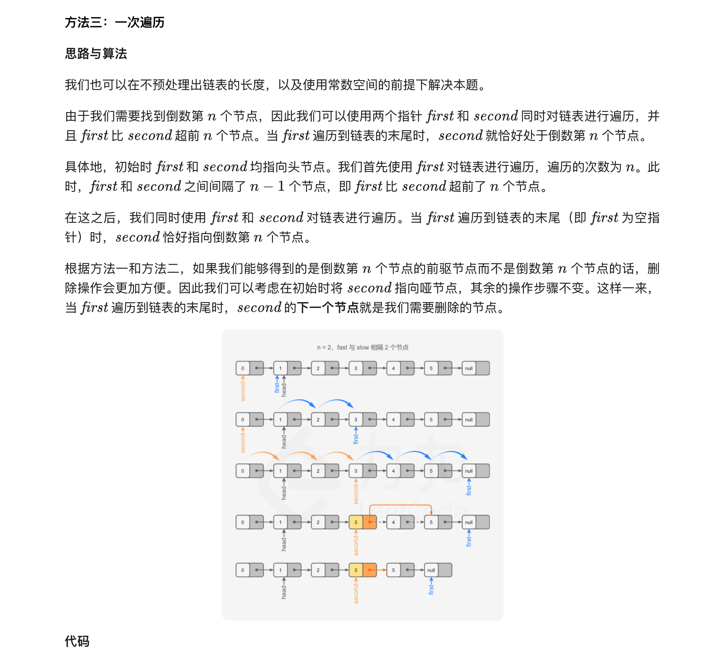

### 官方题解 [@link](https://leetcode-cn.com/problems/remove-nth-node-from-end-of-list/solution/shan-chu-lian-biao-de-dao-shu-di-nge-jie-dian-b-61/)


```Golang
func getLength(head *ListNode) (length int) {
    for ; head != nil; head = head.Next {
        length++
    }
    return
}

func removeNthFromEnd(head *ListNode, n int) *ListNode {
    length := getLength(head)
    dummy := &ListNode{0, head}
    cur := dummy
    for i := 0; i < length-n; i++ {
        cur = cur.Next
    }
    cur.Next = cur.Next.Next
    return dummy.Next
}
```


```Golang
func removeNthFromEnd(head *ListNode, n int) *ListNode {
    nodes := []*ListNode{}
    dummy := &ListNode{0, head}
    for node := dummy; node != nil; node = node.Next {
        nodes = append(nodes, node)
    }
    prev := nodes[len(nodes)-1-n]
    prev.Next = prev.Next.Next
    return dummy.Next
}
```


```Golang
func removeNthFromEnd(head *ListNode, n int) *ListNode {
    dummy := &ListNode{0, head}
    first, second := head, dummy
    for i := 0; i < n; i++ {
        first = first.Next
    }
    for ; first != nil; first = first.Next {
        second = second.Next
    }
    second.Next = second.Next.Next
    return dummy.Next
}
```
