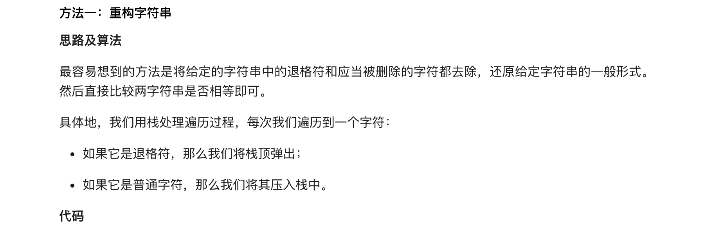
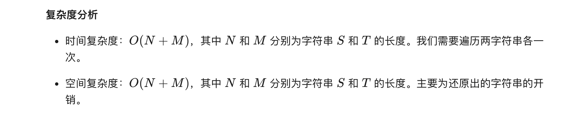
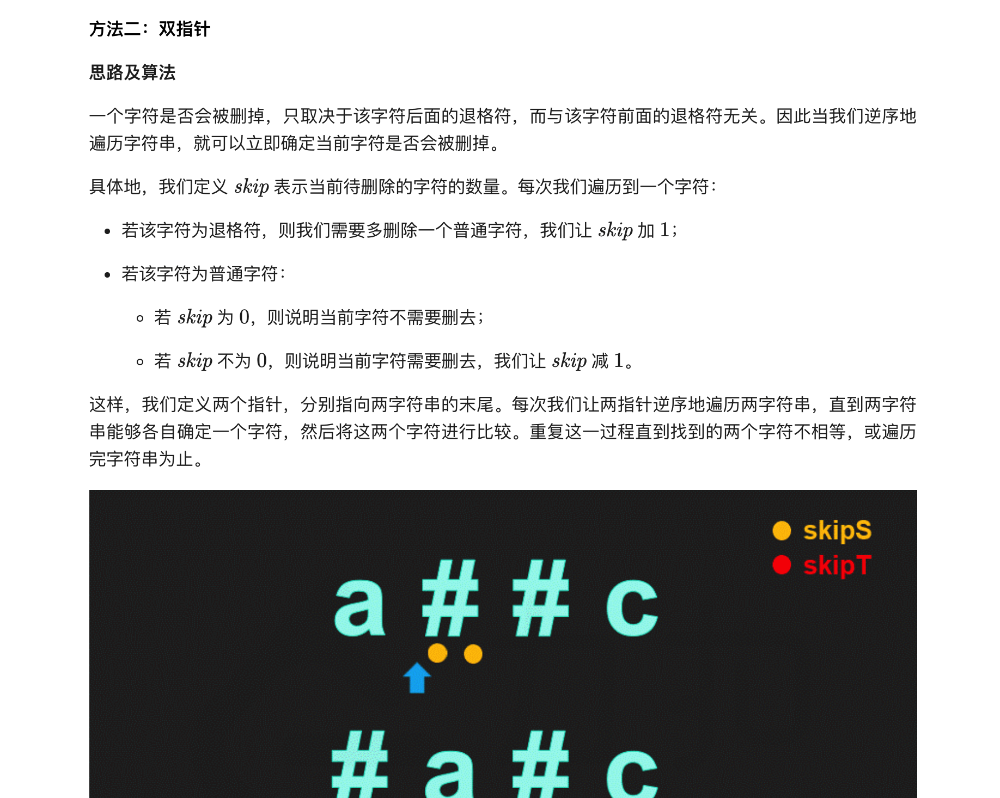
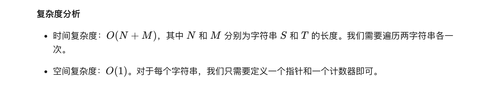

### 官方题解 [@link](https://leetcode-cn.com/problems/backspace-string-compare/solution/bi-jiao-han-tui-ge-de-zi-fu-chuan-by-leetcode-solu/)


```Golang
func build(str string) string {
    s := []byte{}
    for i := range str {
        if str[i] != '#' {
            s = append(s, str[i])
        } else if len(s) > 0 {
            s = s[:len(s)-1]
        }
    }
    return string(s)
}

func backspaceCompare(s, t string) bool {
    return build(s) == build(t)
}
```


```Golang
func backspaceCompare(s, t string) bool {
    skipS, skipT := 0, 0
    i, j := len(s)-1, len(t)-1
    for i >= 0 || j >= 0 {
        for i >= 0 {
            if s[i] == '#' {
                skipS++
                i--
            } else if skipS > 0 {
                skipS--
                i--
            } else {
                break
            }
        }
        for j >= 0 {
            if t[j] == '#' {
                skipT++
                j--
            } else if skipT > 0 {
                skipT--
                j--
            } else {
                break
            }
        }
        if i >= 0 && j >= 0 {
            if s[i] != t[j] {
                return false
            }
        } else if i >= 0 || j >= 0 {
            return false
        }
        i--
        j--
    }
    return true
}
```
