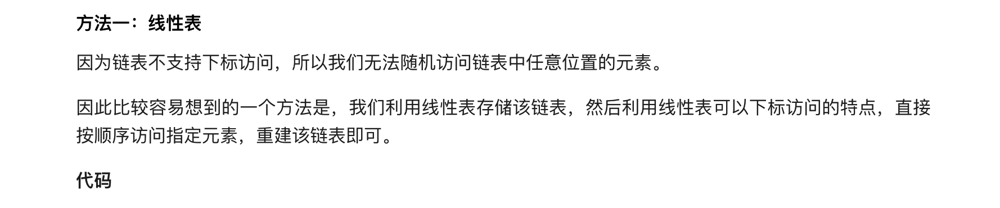
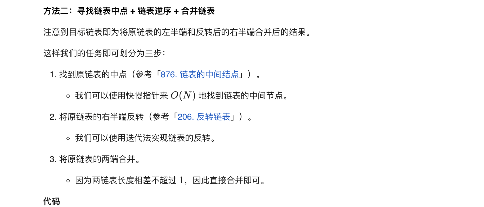

### 官方题解 [@link](https://leetcode-cn.com/problems/reorder-list/solution/zhong-pai-lian-biao-by-leetcode-solution/)


```Golang
func reorderList(head *ListNode) {
    if head == nil {
        return
    }
    nodes := []*ListNode{}
    for node := head; node != nil; node = node.Next {
        nodes = append(nodes, node)
    }
    i, j := 0, len(nodes)-1
    for i < j {
        nodes[i].Next = nodes[j]
        i++
        if i == j {
            break
        }
        nodes[j].Next = nodes[i]
        j--
    }
    nodes[i].Next = nil
}
```


```Golang
func middleNode(head *ListNode) *ListNode {
    slow, fast := head, head
    for fast.Next != nil && fast.Next.Next != nil {
        slow = slow.Next
        fast = fast.Next.Next
    }
    return slow
}

func reverseList(head *ListNode) *ListNode {
    var prev, cur *ListNode = nil, head
    for cur != nil {
        nextTmp := cur.Next
        cur.Next = prev
        prev = cur
        cur = nextTmp
    }
    return prev
}

func mergeList(l1, l2 *ListNode) {
    var l1Tmp, l2Tmp *ListNode
    for l1 != nil && l2 != nil {
        l1Tmp = l1.Next
        l2Tmp = l2.Next

        l1.Next = l2
        l1 = l1Tmp

        l2.Next = l1
        l2 = l2Tmp
    }
}

func reorderList(head *ListNode) {
    if head == nil {
        return
    }
    mid := middleNode(head)
    l1 := head
    l2 := mid.Next
    mid.Next = nil
    l2 = reverseList(l2)
    mergeList(l1, l2)
}
```
