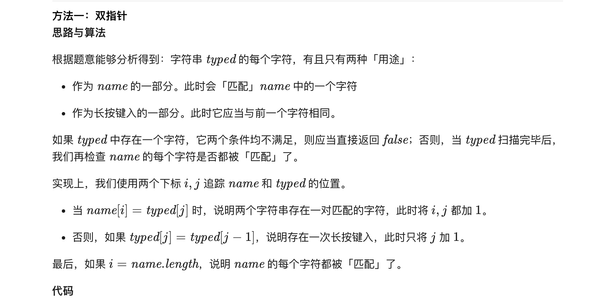

### 官方题解 [@link](https://leetcode-cn.com/problems/long-pressed-name/solution/chang-an-jian-ru-by-leetcode-solution/)


```Golang
func isLongPressedName(name string, typed string) bool {
    i, j := 0, 0
    for j < len(typed) {
        if i < len(name) && name[i] == typed[j] {
            i++
            j++
        } else if j > 0 && typed[j] == typed[j-1] {
            j++
        } else {
            return false
        }
    }
    return i == len(name)
}
```
