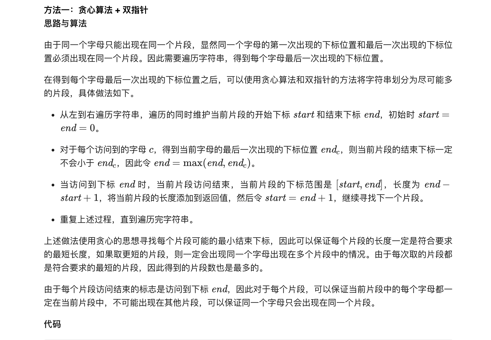
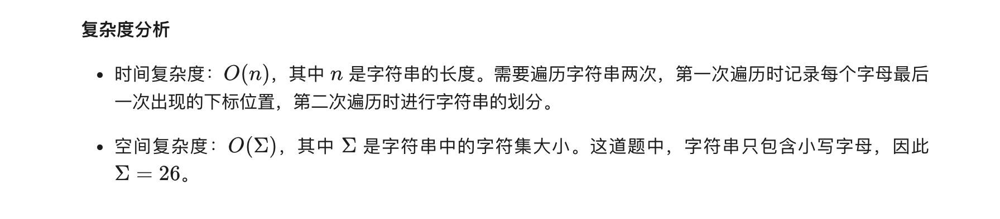

### 官方题解 [@link](https://leetcode-cn.com/problems/partition-labels/solution/hua-fen-zi-mu-qu-jian-by-leetcode-solution/)


```Golang
func partitionLabels(s string) (partition []int) {
    lastPos := [26]int{}
    for i, c := range s {
        lastPos[c-'a'] = i
    }
    start, end := 0, 0
    for i, c := range s {
        if lastPos[c-'a'] > end {
            end = lastPos[c-'a']
        }
        if i == end {
            partition = append(partition, end-start+1)
            start = end + 1
        }
    }
    return
}
```
