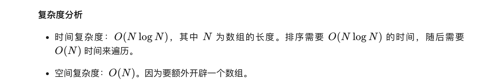

### 官方题解 [@link](https://leetcode-cn.com/problems/how-many-numbers-are-smaller-than-the-current-number/solution/you-duo-shao-xiao-yu-dang-qian-shu-zi-de-shu-zi--2/)


```Golang
func smallerNumbersThanCurrent(nums []int) (ans []int) {
    for _, v := range nums {
        cnt := 0
        for _, w := range nums {
            if w < v {
                cnt++
            }
        }
        ans = append(ans, cnt)
    }
    return
}
```


```Golang
type pair struct{ v, pos int }

func smallerNumbersThanCurrent(nums []int) []int {
    n := len(nums)
    data := make([]pair, n)
    for i, v := range nums {
        data[i] = pair{v, i}
    }
    sort.Slice(data, func(i, j int) bool { return data[i].v < data[j].v })
    ans := make([]int, n)
    prev := -1
    for i, d := range data {
        if prev == -1 || d.v != data[i-1].v {
            prev = i
        }
        ans[d.pos] = prev
    }
    return ans
}
```


```Golang
func smallerNumbersThanCurrent(nums []int) []int {
    cnt := [101]int{}
    for _, v := range nums {
        cnt[v]++
    }
    for i := 0; i < 100; i++ {
        cnt[i+1] += cnt[i]
    }
    ans := make([]int, len(nums))
    for i, v := range nums {
        if v > 0 {
            ans[i] = cnt[v-1]
        }
    }
    return ans
}
```
