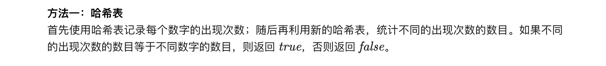

### 官方题解 [@link](https://leetcode-cn.com/problems/unique-number-of-occurrences/solution/du-yi-wu-er-de-chu-xian-ci-shu-by-leetcode-solutio/)


```Golang
func uniqueOccurrences(arr []int) bool {
    cnts := map[int]int{}
    for _, v := range arr {
        cnts[v]++
    }
    times := map[int]struct{}{}
    for _, c := range cnts {
        times[c] = struct{}{}
    }
    return len(times) == len(cnts)
}
```

