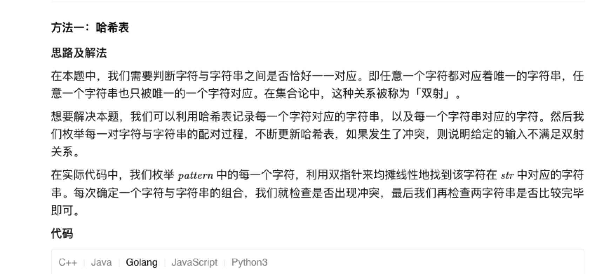
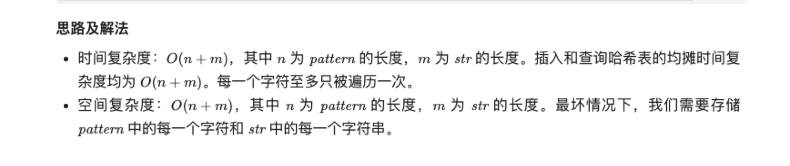

### 官方题解 [@link](https://leetcode-cn.com/problems/word-pattern/solution/dan-ci-gui-lu-by-leetcode-solution-6vqv/)


```Golang
func wordPattern(pattern string, s string) bool {
    word2ch := map[string]byte{}
    ch2word := map[byte]string{}
    words := strings.Split(s, " ")
    if len(pattern) != len(words) {
        return false
    }
    for i, word := range words {
        ch := pattern[i]
        if word2ch[word] > 0 && word2ch[word] != ch || ch2word[ch] != "" && ch2word[ch] != word {
            return false
        }
        word2ch[word] = ch
        ch2word[ch] = word
    }
    return true
}
```

